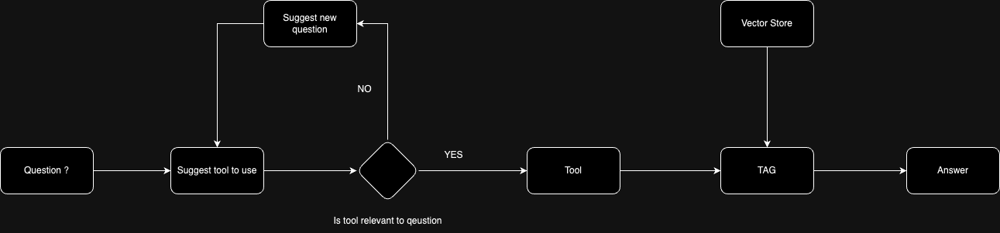

# Chatbot Open Source
=======================

## Introduction
---------------

Welcome to our open-source QA chatbot! This project allows you to build and deploy a conversational AI model that can answer questions and provide helpful responses.



## Getting Started
-------------------

### Step 1: Download Ollama

[Download the Ollama model](https://llama.meta.com/) from Meta AI. This model is the backbone of our chatbot's conversational abilities.

### Step 2: Activate Virtual Environment

Activate your virtual environment (venv) to ensure that all dependencies are installed correctly.

### Step 3: Install Dependencies

```bash
pip install -r requirements.txt
```

### Step 4: Configure Environment Variables

Update the `sample.env` file to `.env` and configure the environment variables as needed.

### Step 5: Run the Chatbot

* **Client:** `streamlit run api/client.py`
* **Server:** `python api/server.py`

## Example Use Cases
--------------------

* **Customer Support:** Provide automated support to customers and help them with their queries.
* **Language Learning:** Use the chatbot as a language learning tool to practice conversational skills.
* **Entertainment:** Engage in fun conversations with the chatbot and explore its capabilities.

## TODO
---------------
- [x] Setting up Chatbot
- [x] Memory on Database
- [ ] Setting up tools
    - [ ] Weather
    - [ ] LinkedIn
    - [ ] Search Engine (Google/DuckDuck/Etc)
    - [X] News
    - [ ] DateTime
- [ ] Web UI
- [ ] Setting up Conscious
- [ ] IOT

## Contributing
---------------

We welcome contributions to our open-source chatbot project! If you'd like to contribute, please:

1. Fork the repository
2. Make your changes
3. Submit a pull request

## License
-------

This project is licensed under the [MIT License](https://opensource.org/licenses/MIT).

## Author
-------

* **Darwin Fegarido** ([darwinfegarido@gmail.com](mailto:darwinfegarido@gmail.com))